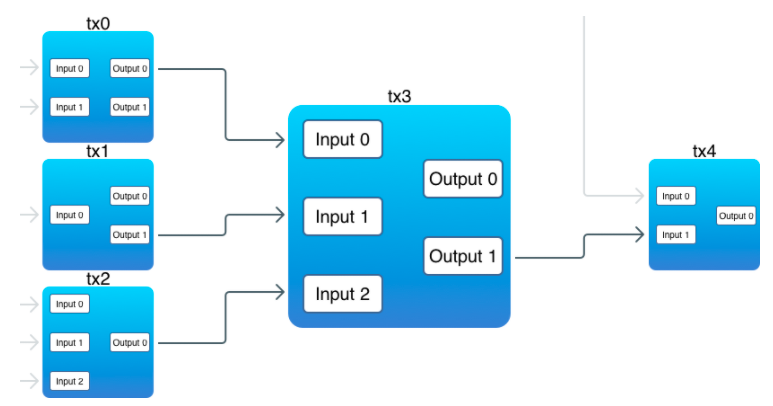

### Реализация blockchain на golang

Используется БД <a href="https://github.com/dgraph-io/badger" >BadgerDB</a>

используемые ключи в бд
* lh - lastHash

##### Команды
```shell
# создает новый кошелек
go run main.go createwallet

# список всех доступных кошельков
go run main.go listaddresses

# создание блокчейна после address передается
# адрес сгенерированный при создания командой createwallet
# имеет такой вид "19Vto6q9Gse3GxKRGYGUsGitPqXbB1pZxM"
go run main.go createblockchain -address {addres}

# выведет информацию по блокчейну и транзакциям в нем
go run main.go printchain

# перевод условных токенов (начисляются 100 токенов при создании блокчейна)
# от одного адреса к другому
go run main.go send -to {address} -from {address} -amount 30

# выводит баланс токенов конкретного адреса
go run main.go getbalance -address {address}
```

##### Основные понятия

<dl>
  <dt>Блокчейн</dt>
  <dd>
    <p>
По сути, блокчейн это база данных определенной структуры: упорядоченный связанный список. 
Это означает, что блоки хранятся в порядке вставки, при чем каждый блок связан с предыдущем.
Такая структура позволяет получить последний блок в цепочке и эффективно получить
блок по его хэшу.
    </p>
    <p>
В данном блокчейне добавление новых блоков проходит очень легко и быстро, в реальном же
блокчейне добавление новых блоков требует определенной работы: выполнение сложных вычислений,
перед получением права на добавления блока (этот механизм называется <u>Prof-of-Work</u>).
Кроме того, блокчейн — распределенная база, которая не имеет единого центра принятия решения.
Таким образом, новый блок должен быть подтвержден и одобрен другими участниками сети
(данный механизм называется <u>консенсусом</u>)
    </p>
  </dd>
  <dt>Блок</dt>
  <dd>
    <p>
В блокчейне, блоки хранят полезную информацию. Например, в bitcoin блоки хранят транзакции (
каждый блок должен хранить как минимум одну транзакцию),
суть любой криптовалюты. Помимо полезной информации, в блоке содержится служебная информация:
версия, дата создания в виде timestamp и хеш предыдущего блока.
    </p>
  </dd>
  <dt>Proof-of-Work(PoW)</dt>
  <dd>
    <p>
    При добавления нового блока в блокчейн необходимо проделать некоторую сложную работу.
Именно эта сложная работа делает блокчейн надежным и целостным. В блокчейне некоторые
участники (майнеры) сети работают над поддержанием сети, добавлением в блокчейн новых
блоков и получают вознаграждение за свою работу. В результате их работы блок встраивается
в блокчейн надежным способом, что обеспечивает стабильность всей базы данных блокчейна.
Стоит отметить, что тот, кто выполнил работу, должен также доказать её выполнение.Этот
весь «сделай сложную работу и докажи её»-механизм называется <u>Proof-of-Work (доказательство работы)</u>.
    </p>
    <p>
К примеру в Биткоине цель такой работы — это нахождение хеша блока, который удовлетворяет
определенным требованиям. Данный хеш и служит доказательством. Таким образом, поиск 
доказательства и есть фактическая работа.
    </p>
    <p>
Важно Proof-of-Work алгоритмы должны соответствовать следующему требованию: выполнение
работы должно быть сложным, но проверка доказательства должна быть простой.
Проверка доказательства обычно передается кому-то стороннему, поэтому у них данная 
проверка не должна занимать много времени.
    </p>
  </dd>
 <dt>Транзакции</dt>
  <dd>
    <p>
Цель цепи блоков — это хранить транзакции безопасным и надежным способом, чтобы никто не смог
модифицировать их после создания.
    </p>
    <p>
    В данной реализации, транзакция представляет собой комбинацию входов и выходов.
    Входы новой транзакции ссылаются на выходы предыдущей транзакции (есть
исключение, о котором мы поговорим ниже). Выходы — место, где хранятся данные (монеты)
    </p>

Важно : <br>
- Есть выходы, которые не связаны с входами. <br>
- В одной транзакции входы могут ссылаться на выходы нескольких транзакций. <br>
- Вход всегда должен ссылаться на выход <br>
<p>
Выходы неделимы, это значит что вы не можете ссылаться на часть своего значения.Когда
выход ссылается на новую транзакцию он расходуется полностью. И если его значение больше,
 чем требуется, генерируется разница и новое значение отправляется обратно отправителю.
 Каждый выход имеет сценарий разблокировки, который определяет логику разблокировки выхода.
Каждая новая транзакция должна иметь как минимум один вход и выход. Вход ссылается
на результат предыдущей транзакции и предоставляет данные (поле Sig), которые
используются в сценарии разблокировки выхода, чтобы разблокировать его и использовать
его значение для создания новых выходов.
</p>
<p>
 Логика inputs-referencing-outputs представляет собой классическую ситуацию
«курица или яйцо»: входы производят выходы, а выходы позволяют создавать входы.
И в Биткоине выходы всегда появляются перед входами
</p>
<p>
Транзакция <b>coinbase</b> — это особый тип транзакции, который не требует ранее существующих выходов.
Она создается когда начинается майнинг блока. Он создает выходы (т. е. «Монеты») из ниоткуда.
Это награда, которую майнеры получают за добычу новых блоков.Как вы знаете, в начале цепи есть блок генезиса.
Именно этот блок генерирует самый первый выход в цепочке блоков. И никаких предыдущих
выходов не требуется, поскольку нет предыдущих транзакций и нет никаких выходов.
</p>
</dd>
</dl>
 